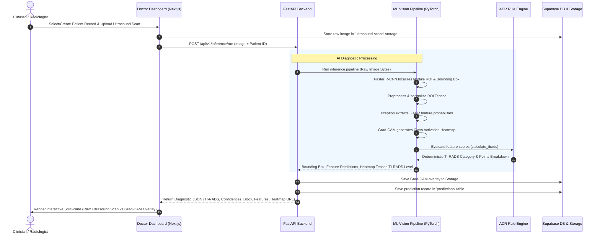
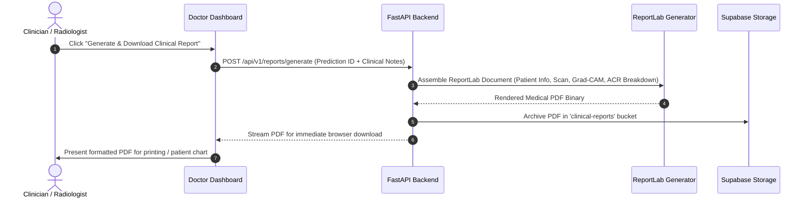
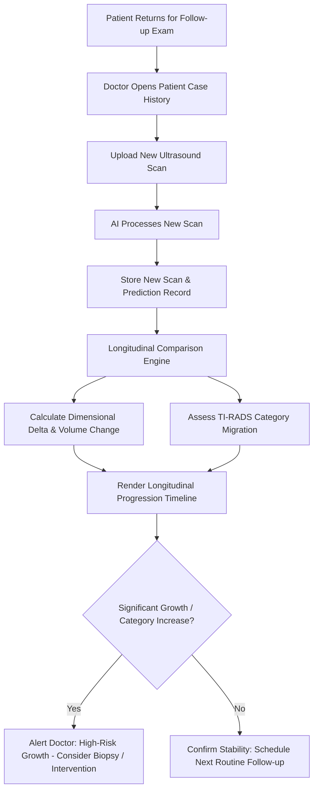
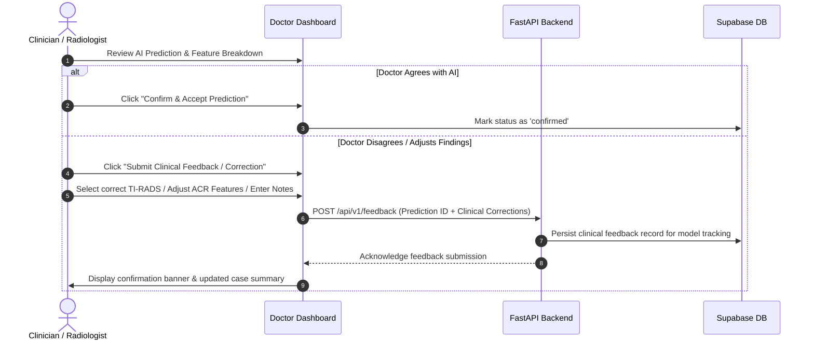

# ThyroVision: Approach and Workflow (Doctor & Clinical Perspective)

## Executive Summary

**ThyroVision** is an intelligent, full-stack **Clinical Decision Support System (CDSS)** powered by Deep Learning, Computer Vision, and Explainable AI (XAI). It is specifically engineered to assist endocrinologists, radiologists, and treating clinicians in identifying, evaluating, and categorizing thyroid nodules from 2D B-mode ultrasound scans in strict accordance with the international **ACR TI-RADS (American College of Radiology Thyroid Imaging Reporting and Data System)** clinical standard.

ThyroVision acts as a trusted diagnostic pair-assistant, standardizing nodule evaluation, accelerating clinical throughput, reducing inter-observer diagnostic variability, and providing fully interpretable reasoning behind every AI finding.

```
┌─────────────────────────────────────────────────────────────────────────────┐
│                       CLINICIAN DIAGNOSTIC PARADIGM                         │
└─────────────────────────────────────────────────────────────────────────────┘
  Doctor Uploads Scan ──► AI Detects Nodule ROI ──► Extracts 5 ACR Features
                                                            │
  Interactive Review  ◄── Grad-CAM Heatmap   ◄── Deterministic TI-RADS Score
          │
          ├──► Download Medical PDF Report & Treatment Recommendations
          ├──► Longitudinal Tracking (Growth Rate & Scan Comparison)
          ├──► Consult Multimodal AI Clinical Assistant (ACR Knowledge & Simulation)
          └──► Submit Clinical Feedback to Refine Diagnostic Accuracy
```

---

## 1. Clinical Problem & Diagnostic Paradigm

### 1.1 The Clinical Challenge
- **High Prevalence**: Thyroid nodules occur in 50%–60% of the adult population.
- **Diagnostic Dilemma**: The vast majority of nodules are benign, yet distinguishing benign from malignant lesions creates significant cognitive burden.
- **Inter-Observer Variability**: Diagnostic agreement among clinicians varies widely due to subjective interpretation of ultrasound acoustic textures.
- **Unnecessary Invasions**: Over-biopsying benign nodules leads to unnecessary Fine Needle Aspiration (FNA) procedures, patient anxiety, and increased healthcare costs.

### 1.2 The ACR TI-RADS Standardization
ThyroVision aligns strictly with the **American College of Radiology (ACR) TI-RADS** framework, which assigns point values across 5 distinct morphological categories:

```
┌─────────────────────────────────────────────────────────────────────────────┐
│                             ACR TI-RADS CATEGORIES                          │
├───────────────────┬───────────────────────────────────────────┬─────────────┤
│ Category          │ Feature Options                           │ Point Range │
├───────────────────┼───────────────────────────────────────────┼─────────────┤
│ 1. Composition    │ Cystic / Spongiform (0), Mixed (1), Solid │ 0 – 2 pts   │
│ 2. Echogenicity   │ Anechoic (0), Hypo/Isoechoic (1),         │ 0 – 3 pts   │
│                   │ Hypoechoic (2), Very Hypoechoic (3)       │             │
│ 3. Shape          │ Wider-than-tall (0), Taller-than-wide (3) │ 0 or 3 pts  │
│ 4. Margin         │ Smooth (0), Ill-defined (0),              │ 0 – 3 pts   │
│                   │ Lobulated/Irregular (2), Extrathyroidal(3)│             │
│ 5. Echogenic Foci │ None (0), Large Comet-tail (0),           │ 0 – 3 pts   │
│                   │ Macrocalcifications (1), Peripheral (2),  │             │
│                   │ Punctate Microcalcifications (3)          │             │
└───────────────────┴───────────────────────────────────────────┴─────────────┘
                                     │
                                     ▼
                    Total Score Summation (0 to 14+ pts)
                                     │
      ┌───────────┬───────────┬──────┴────┬───────────┬───────────┐
      ▼           ▼           ▼           ▼           ▼           ▼
     TR1         TR2         TR3         TR4A        TR4B        TR5
   0 points    2 points    3 points    4-6 points  7-8 points   ≥9 points
    Benign   Not Suspicious Mildly Susp.  Moderately Suspicious  Highly Susp.
```

---

## 2. Technical & Architectural Approach (Doctor's View)

### 2.1 Core Pillars

```
┌──────────────────────────────────────────────────────────────────────────────┐
│                           DOCTOR-FACING ARCHITECTURE                         │
└──────────────────────────────────────────────────────────────────────────────┘

  CLINICIAN CLIENT (BROWSER)                        CLOUD BACKEND SERVICES
 ┌──────────────────────────┐                      ┌─────────────────────────┐
 │ Next.js Doctor Dashboard │   HTTPS / REST API   │ FastAPI Clinical API    │
 │ - Secure Authentication  │ ◄──────────────────► │ - Pydantic Validation   │
 │ - Patient Case Registry  │   JWT Bearer Token   │ - Structured Responses  │
 │ - Split-Pane Viewer      │                      │ - Secure Image Handling │
 └────────────┬─────────────┘                      └────────────┬────────────┘
              │                                                 │
              │ Instant Data Sync                               ├────────────────────────┐
              ▼                                                 ▼                        ▼
 ┌──────────────────────────┐                      ┌───────────────────────┐ ┌──────────────────┐
 │ Supabase Cloud           │                      │ ML Inference Engine   │ │ Clinical AI &    │
 │ - Patient & Scan Records │                      │ - Faster R-CNN (ROI)  │ │ Explainability   │
 │ - High-Res Storage S3    │                      │ - Xception Classifier │ │ - Gemini GenAI   │
 │ - Doctor Feedback Store  │                      │ - ACR TI-RADS Engine  │ │ - ACR Guidelines │
 └──────────────────────────┘                      │ - Grad-CAM Visualizer │ │ - Simulation     │
                                                   └───────────────────────┘ └──────────────────┘
```

1. **Two-Stage Interpretable Pipeline**: Instead of treating nodule diagnosis as an opaque black box, the system first locates the nodule bounding box and then independently scores the 5 ACR features.
2. **Deterministic Clinical Rule Engine**: The AI classifies individual morphological features, while a deterministic rule engine calculates the final TI-RADS category. This guarantees 100% mathematical consistency with ACR TI-RADS guidelines.
3. **Visual Explainability (Grad-CAM)**: Clinicians can inspect visual heatmaps showing the acoustic areas that contributed to the AI's classification.
4. **Interactive Clinical Dialogue**: A built-in medical AI companion answers questions regarding the scan, compares current findings to clinical guidelines, and simulates "what-if" counterfactual scenarios.
5. **Doctor-in-the-Loop Sovereignty**: The doctor retains complete diagnostic authority. Doctors can accept AI results, modify feature selections, or submit clinical feedback.

---

## 3. End-to-End Clinical Workflows

### 3.1 Workflow 1: Ultrasound Scan Ingestion & AI Diagnostic Inference

This is the primary clinical workflow where a doctor uploads an ultrasound image, receives instant AI predictions with explainability maps, and reviews the findings.



#### Step-by-Step Clinical Experience:
1. **Upload**: The clinician selects a patient from the registry and uploads a B-mode ultrasound image (JPEG, PNG, or DICOM export).
2. **Detection**: Faster R-CNN automatically detects solitary or dominant thyroid nodules and draws a bounding box around the Region of Interest (ROI).
3. **Feature Analysis**: The Xception classifier analyzes the 5 acoustic dimensions:
   - **Composition**: Cystic, Spongiform, Mixed, or Solid.
   - **Echogenicity**: Anechoic, Hyperechoic/Isoechoic, Hypoechoic, or Very Hypoechoic.
   - **Shape**: Wider-than-tall vs. Taller-than-wide.
   - **Margin**: Smooth, Ill-defined, Lobulated/Irregular, or Extra-thyroidal Extension.
   - **Echogenic Foci**: None, Macrocalcifications, Peripheral Rim, or Punctate Microcalcifications.
4. **Scoring**: The ACR TI-RADS rule engine sums the feature points and outputs the final score (**TR1** to **TR5**).
5. **Interactive Review**: The doctor inspects the scan using a **Synchronized Split-Pane Viewer** with adjustable heatmap transparency, zoom, and panning.

---

### 3.2 Workflow 2: Clinical PDF Report Generation



#### Contents of the Generated Medical Report:
- **Patient Demographics**: Name, ID, Age, Gender, Examination Date.
- **Ultrasound Visuals**: High-resolution side-by-side inclusion of the raw scan and Grad-CAM attention overlay.
- **Nodule Metrics**: Bounding box coordinates, estimated dimensions, and focal location.
- **ACR TI-RADS Scorecard**: Detailed itemized table showing point contributions for each of the 5 morphological categories.
- **Clinical Recommendation**: Automated follow-up action based on nodule size and TI-RADS risk (e.g., *FNA Biopsy recommended if $\ge 1.5\text{ cm}$*, or *Follow-up ultrasound in 12 months*).
- **Clinician Signature Block**: Dedicated area for doctor review notes, impression, and sign-off.

---

### 3.3 Workflow 3: Longitudinal Patient Tracking & Progression Analysis



- **Growth Monitoring**: Computes dimensional changes ($\Delta \text{Diameter}$, $\Delta \text{Volume}$) across multiple visits.
- **Category Migration**: Highlights shifts in risk levels (e.g., nodule migrating from TR3 to TR4A).
- **Visual Progression Timeline**: Renders historical trend graphs and chronological scan comparisons directly on the patient profile.

---

### 3.4 Workflow 4: Clinician Feedback & Active Dialogue Loop

The clinician has the ultimate authority to confirm or adjust AI findings:



---

### 3.5 Workflow 5: Interactive AI Clinical Assistant & Simulation

ThyroVision includes an integrated multimodal clinical AI assistant to support complex diagnostic decision-making:

```
┌─────────────────────────────────────────────────────────────────────────────┐
│                     MULTIMODAL CLINICAL ASSISTANT MODES                     │
└─────────────────────────────────────────────────────────────────────────────┘

  1. ACR Guidelines Q&A (RAG)
     Doctor: "Why is a 1.2 cm TR4 nodule recommended for follow-up rather than FNA?"
     AI: Cites official ACR TI-RADS biopsy thresholds (FNA threshold for TR4 is ≥ 1.5 cm).

  2. Visual Explanation
     Doctor: "Explain what prompted the high echogenicity score."
     AI: Analyzes Grad-CAM activation and explains acoustic pattern contributions.

  3. Counterfactual Simulation ("What-If" Analysis)
     Doctor: "What would the TI-RADS score be if margins were lobulated instead of smooth?"
     AI: Recalculates point sum in real time (+2 points) and shows the resulting risk shift.
```

---

### 3.6 Workflow 6: Real-Time Alerts & Follow-Up Notifications

- **Urgent Case Alerts**: Instant visual badges for highly suspicious nodules (TR5).
- **Scheduled Follow-up Reminders**: Automated reminders when a patient is due for a 6, 12, or 24-month repeat ultrasound examination.
- **Push & In-App Notifications**: Delivered via Firebase Cloud Messaging (FCM) and the dashboard notification center.

---

## 4. Clinician Data Life Cycle

```
[Patient Registration]
        │
        ▼
[Ultrasound Scan Upload]
        │
        ▼
[AI Diagnostic Inference]
  ├── ROI Bounding Box
  ├── 5 ACR Feature Scores
  ├── Deterministic TI-RADS Level
  └── Grad-CAM Attention Heatmap
        │
   ┌────┴─────────────────────────────┐
   ▼                                  ▼
[Doctor Reviews & Accepts]    [Doctor Modifies / Submits Feedback]
   │                                  │
   ├──────────────────────────────────┤
   ▼
[Clinical PDF Report Generated]
   │
   ▼
[Longitudinal Follow-up Scheduled]
```

---

## 5. Clinical Safety & Decision Support Principles

1. **Physician Sovereignty**: ThyroVision is designed strictly as a clinical decision support tool. It does not replace medical judgment or professional diagnosis.
2. **Zero Black-Box Scoring**: Every diagnostic recommendation is accompanied by:
   - Full 5-feature ACR breakdown
   - Bounding box localization coordinates
   - Visual Grad-CAM acoustic attention overlay
3. **Standardized Clinical Grounding**: Scoring adheres to official ACR TI-RADS point tables, ensuring dependable, repeatable, and clinically validated results.
