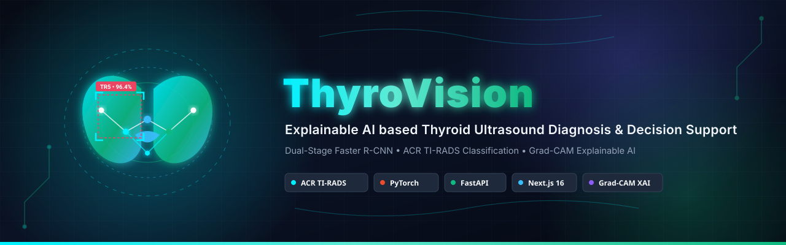

<p align="center">
  
</p>


<h1 align="center">ThyroVision 🩺</h1>
<p align="center">
  <strong>Advanced Thyroid Ultrasound AI Diagnosis & Decision Support System</strong>
</p>

<p align="center">
  <a href="https://github.com/SanjayBarman15/Thyro-Vision/graphs/contributors"></a>
  <a href="https://github.com/SanjayBarman15/Thyro-Vision/stargazers"></a>
  <a href="https://github.com/SanjayBarman15/Thyro-Vision/network/members"></a>
  <a href="https://github.com/SanjayBarman15/Thyro-Vision/issues"></a>
</p>

<p align="center">
  
  
  
  
  
  
  
  
  
  
</p>

---

> [!WARNING]
> **Clinical Disclaimer**: ThyroVision is a clinical decision support system designed to assist medical practitioners. It **does not replace** professional medical diagnosis, clinical judgment, or patient therapy.

---

## 👥 Meet the Team: ZeDev

ThyroVision is conceptualized, designed, and developed by **ZeDev**:

| Contributor | Principal Role | GitHub Profile |
| :--- | :--- | :--- |
| **Md Ayan Qurashi** | AI Pipeline & Deep Learning Architecture | [@ayan15888](https://github.com/ayan15888) |
| **Sanjay Barman** | Backend, Cloud Infrastructure & DB Services | [@SanjayBarman15](https://github.com/SanjayBarman15) |
| **Arindam Chakrowarty** | Frontend UI/UX & Interactive Canvas Annotation | [@rajatarindam](https://github.com/rajatarindam) |
| **Sumitra Devi** | Clinical Curation Pipeline & Dataset Operations | [@sumi-sky7](https://github.com/sumi-sky7) |

---

## 💡 System Overview

ThyroVision is a full-stack **Clinical Decision Support System (CDSS)** that standardizes thyroid ultrasound analysis. It assists endocrinologists, radiologists, and clinicians in classifying nodules using the international **ACR TI-RADS (American College of Radiology Thyroid Imaging Reporting and Data System)** standard.

### Key Capabilities:
* 🔍 **Dual-Stage Pipeline**: Real-time nodule localization (Faster R-CNN) and ACR features classification (Xception / ResNet).
* 🧠 **Explainable AI (XAI)**: Visualizing gradient-weighted class activation maps (Grad-CAM heatmaps) to highlight features like microcalcifications and irregular margins.
* 🔄 **Human-in-the-Loop (HITL) Curation**: Seamless expert feedback forms, admin curation queue with claim locking, and Pascal VOC XML dataset export.
* 📊 **Performance Benchmarks**: Versioned model accuracy dashboards tracking IoU, inference latency, and regression metrics.

---

## 🛠️ Complete Tech Stack

The ThyroVision ecosystem utilizes a high-performance stack for clinical UI/UX, heavy inference pipelines, secure database storage, and cloud infrastructure:

### 1. Frontend Application (UI & Client Logic)
* **Framework & Core**: **Next.js 16 (App Router)** & **React 19**
* **Languages**: **TypeScript**, HTML5, CSS3
* **Styling**: **Tailwind CSS (v4)**, `class-variance-authority` (CVA), `tailwind-merge`, `tailwindcss-animate`
* **State & Query Management**: **Zustand** (client state) & **TanStack React Query v5** (server cache & query synchronization)
* **Interactive Canvas**: **React Konva** (HTML5 canvas-based annotation system for custom bounding box adjustment)
* **Animations & Micro-interactions**: **Framer Motion**, `@tsparticles/react` & `@tsparticles/slim` (interactive background particles)
* **Forms & Validation**: **React Hook Form** integrated with **Zod**
* **Hosting**: **Vercel**

### 2. Backend Inference Engine (API & Processing Services)
* **Framework**: **FastAPI** (Python 3.10+) with **Uvicorn** (ASGI server), **Pydantic v2** & **Pydantic-settings** (schemas)
* **Task Queues & Background Workers**: **Celery** (CPU-heavy queue distribution) with **Redis** (broker)
* **PDF Report Generation**: **ReportLab** (compiles dynamic, patient-specific diagnostic reports)
* **LLM Explainability (RAG)**: **Google GenAI SDK** (Gemini integration for RAG clinical note extraction) & **lxml** (XML parsing)
* **Email & Notifications**: **Resend** (email delivery), **Firebase Admin SDK** (push notifications)
* **API Utilities**: **python-multipart** (form uploads), **python-dotenv** (configuration)

### 3. Machine Learning & Computer Vision Stack (AI Dependencies)
* **Core Framework**: **PyTorch 1.10+** (deep learning model graph computation) & **Torchvision 0.11+** (localization and object detection)
* **Model Backbones**: **TIMM (PyTorch Image Models)** (pretrained Xception & ResNet backbones)
* **Object Localization**: **Faster R-CNN** (Region of Interest detection for nodule localization)
* **Image Processing**: **OpenCV (headless)** (matrix transformations, bounding box cropping), **Pillow (PIL)** (image compression and format translation)
* **Mathematical Utilities**: **NumPy**, **Scikit-Learn** (feature validation, benchmarking), **Matplotlib** (confidence and ROC curve generation)
* **Explainability (XAI)**: Gradient-weighted Class Activation Mapping (**Grad-CAM**) for visual explainability.

### 4. Database, Cloud Infrastructure & AWS Deployment
* **Cloud Hosting Platform**: **AWS EC2** (hosts containerized backend services)
* **Storage Volumes**: **AWS EBS** (persistent block storage mapped to EC2 for hosting PyTorch model binaries and local caching)
* **Container Registry**: **AWS ECR** (stores production Docker images)
* **Reverse Proxy & SSL**: **Nginx** reverse proxy mapped with SSL/TLS certificate termination
* **Database & Auth**: **Supabase (PostgreSQL)** (patient records, predictions, doctor feedback logs, audit trails)
* **Row-Level Security (RLS)**: PostgreSQL policy rules mapping Doctor vs Admin privileges
* **Asset/Object Storage**: **Supabase Storage Buckets** (raw ultrasound B-mode uploads, Grad-CAM heatmap overlays)
* **Memory Caching**: **Redis** / **Upstash Redis** (session cache, claim lock handling)
* **Staging/Dev Hosting**: **Render** (alternative docker container sandbox hosting), **Vercel** (frontend application engine)

---

## 📐 System Architecture

### 1. High-Level Architecture Flow

```
           Doctor (Web Browser)
                    │
                    ▼
      ┌──────────────────────────────┐
      │  Frontend (Next.js - Vercel) │
      └──────────────┬───────────────┘
                     │ Secure HTTPS (Nginx Reverse Proxy)
                     ▼
      ┌──────────────────────────────────────────────┐
      │         AWS EC2 (Dockerized Backend)         │
      │                                              │
      │   ┌───────────────┐      ┌───────────────┐   │
      │   │ FastAPI API   │      │ Celery Worker │   │
      │   └──────┬────────┘      └───────┬───────┘   │
      │          │                       │           │
      │          v                       v           │
      │   ┌───────────────┐      ┌───────────────┐   │
      │   │ PyTorch Engine│      │ Redis Queue   │   │
      │   └──────┬────────┘      └───────────────┘   │
      │          │                                   │
      └──────────┼───────────────────────────────────┘
                 │                       ▲
                 ├───────────────────────┼───────────┐
                 ▼ (Read weights)        │ Auth      │ Data &
         ┌───────────────┐       ┌───────┴───────┐   │ Images
         │  AWS EBS Vol  │       │ Supabase Auth │   ▼
         │ (.pt models)  │       │  & Database   │ ┌───────────────┐
         └───────────────┘       └───────────────┘ │ Supabase      │
                                                   │ Storage Buckets│
                                                   └───────────────┘
```

### 2. Workspace Directory Structure

```
Thyro-Vision/
├── backend/
│   ├── app/
│   │   ├── api/                 # API endpoint routers (inference, feedbacks, reports)
│   │   ├── services/            # Deep Learning pipelines & Business logic
│   │   │   ├── inference/       # Faster R-CNN, Xception inference orchestration
│   │   │   ├── ruleEngine/      # Deterministic ACR TI-RADS scoring engine
│   │   │   └── explainability/  # RAG client and LLM explanation generators
│   │   ├── db/                  # Supabase clients & Auth verification middleware
│   │   └── utils/               # Loggers, image & box transformation utilities
│   ├── main.py                  # FastAPI application entrypoint
│   ├── requirements.txt         # Backend Python dependencies
│   └── Dockerfile               # Backend production build Dockerfile
│
├── frontend/
│   ├── app/                     # Next.js pages, client layouts, admin dashboards
│   ├── components/              # Interactive UI (Curation workspace, Annotation canvases)
│   ├── package.json             # Frontend packages
│   └── tailwind.config.js       # Styling configuration
│
├── models/                      # Deep learning model weight binary checkpoints (.pt/.pth)
├── training/                    # Model training, evaluation, and fine-tuning notebooks
└── supabase_schema.sql          # SQL schema representing the DB, tables, & functions
```

---

## 🧠 Deep Learning & Explainability Pipeline

ThyroVision executes a structured computer vision inference sequence on each ultrasound upload:

1. **Localization**: B-mode ultrasound scans pass through a **Faster R-CNN** network fine-tuned to extract nodule bounding boxes (Region of Interest - ROI).
2. **ACR Feature Extraction**: The isolated ROI is processed by an **Xception / ResNet** backbone to classify 5 key characteristics:
   * **Composition** (0-2 pts)
   * **Echogenicity** (0-3 pts)
   * **Shape** (0 or 3 pts)
   * **Margin** (0-3 pts)
   * **Echogenic Foci** (0-3 pts)
3. **Scoring & Classification**: The deterministic `ruleEngine/tirads.py` aggregates these scores to assign the final ACR category:
   $$\text{Points} \le 1 \rightarrow \text{TR1 (Benign)} \quad \dots \quad \text{Points} \ge 7 \rightarrow \text{TR5 (Highly Suspicious)}$$
4. **Grad-CAM Overlay**: Gradients are captured relative to the final convolutional layer:
   ```python
   target_layer = model.backbone.layer4[-1]
   ```
   A class activation map is overlaid on the scan to highlight high-risk echogenic foci or irregular margins, which is then stored in Supabase Storage.

---

## 🔄 Human-in-the-Loop Curation Loop

To guarantee clinical safety and enable continuous improvement, ThyroVision integrates a complete dataset curation loop:

```
  Ultrasound Inference ──► Expert Diagnostic Review ──► Corrected Feedback (is_correct: false)
                                                                 │
  Model Retraining Notebooks ◄── Pascal VOC Dataset Export ◄── Admin Curation Queue (Claim Lock)
```

1. **Doctor Feedback**: Diagnosing clinicians verify the AI. If incorrect, they submit the true values which are saved in `prediction_feedback`.
2. **Auto-Queue**: Negative feedback automatically generates a `draft` candidate inside `training_labels` (filtering out scans with confidence < 0.3).
3. **Concurrency Locking**: When an admin selects a label to annotate, the database runs `claim_training_label()` to lock the item for 30 minutes, preventing duplicate annotations.
4. **Interactive SVG Canvas**: Admins adjust bounding box coordinates and select final ground-truth ACR features.
5. **XML Export**: Verified dataset records are packaged into a zip archive with Pascal VOC-compliant annotations and images.

---

## 🐳 Dockerization

The backend service is containerized for production reliability and fast deployment:

```dockerfile
FROM python:3.10-slim

ENV PYTHONUNBUFFERED=1
WORKDIR /app

RUN apt-get update && apt-get install -y \
    libgl1 \
    && rm -rf /var/lib/apt/lists/*

COPY requirements.txt .
RUN pip install --no-cache-dir -r requirements.txt

COPY app ./app
COPY main.py .
COPY models ./models

EXPOSE 8000
CMD ["uvicorn", "main:app", "--host", "0.0.0.0", "--port", "8000", "--workers", "1"]
```

> [!NOTE]
> Single-worker configuration (`--workers 1`) is enforced to prevent CUDA/CPU memory duplication and thread contention during PyTorch inference.

---

## 🚀 Local Setup & Installation

### Prerequisites
* Python 3.10+
* Node.js 18+ (npm or yarn)
* Redis Server (local or Upstash instance)

### 1. Backend Setup
1. Navigate to the backend folder:
   ```bash
   cd backend
   ```
2. Create a virtual environment and activate it:
   ```bash
   python -m venv venv
   source venv/bin/activate  # On Windows: venv\Scripts\activate
   ```
3. Install the dependencies:
   ```bash
   pip install -r requirements.txt
   ```
4. Configure the environment variables by duplicating `.env.example` to `.env` and setting your credentials:
   ```env
   SUPABASE_URL=your_supabase_url
   SUPABASE_KEY=your_supabase_anon_or_service_key
   REDIS_URL=redis://localhost:6379/0
   MODEL_VERSION=v1.0.2
   ```
5. Run the FastAPI development server:
   ```bash
   uvicorn main:app --reload --host 0.0.0.0 --port 8000
   ```
6. Run the Celery background worker:
   ```bash
   celery -A app.services.tasks worker --loglevel=info
   ```

### 2. Frontend Setup
1. Navigate to the frontend folder:
   ```bash
   cd ../frontend
   ```
2. Install the node packages:
   ```bash
   npm install
   ```
3. Create your local environment file `.env.local` and specify your connections:
   ```env
   NEXT_PUBLIC_API_URL=http://localhost:8000
   NEXT_PUBLIC_SUPABASE_URL=your_supabase_url
   NEXT_PUBLIC_SUPABASE_ANON_KEY=your_supabase_anon_key
   ```
4. Launch the Next.js development server:
   ```bash
   npm run dev
   ```

---

## 📄 License
This project is licensed under the MIT License - see the LICENSE file for details.

Developed with ❤️ by team **ZeDev**.
